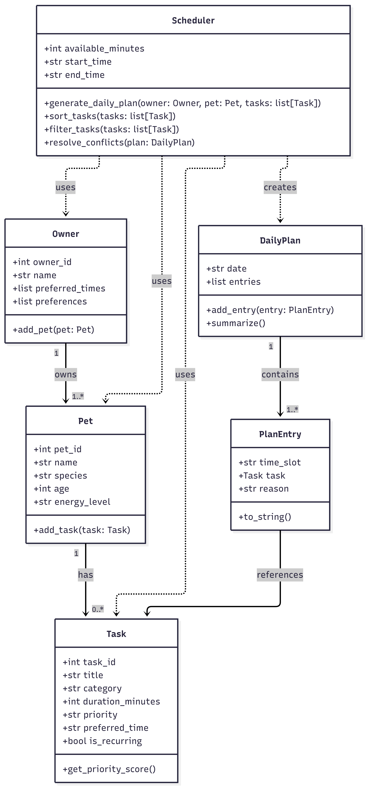

# PawPal+ (Module 2 Project)

You are building **PawPal+**, a Streamlit app that helps a pet owner plan care tasks for their pet.

## Scenario

A busy pet owner needs help staying consistent with pet care. They want an assistant that can:

- Track pet care tasks (walks, feeding, meds, enrichment, grooming, etc.)
- Consider constraints (time available, priority, owner preferences)
- Produce a daily plan and explain why it chose that plan

Your job is to design the system first (UML), then implement the logic in Python, then connect it to the Streamlit UI.

## What you will build

Your final app should:

- Let a user enter basic owner + pet info
- Let a user add/edit tasks (duration + priority at minimum)
- Generate a daily schedule/plan based on constraints and priorities
- Display the plan clearly (and ideally explain the reasoning)
- Include tests for the most important scheduling behaviors

## Getting started

### Setup

```bash
python -m venv .venv
source .venv/bin/activate  # Windows: .venv\Scripts\activate
pip install -r requirements.txt
```

### Suggested workflow

1. Read the scenario carefully and identify requirements and edge cases.
2. Draft a UML diagram (classes, attributes, methods, relationships).
    - ## UML Diagram
  
3. Convert UML into Python class stubs (no logic yet).
4. Implement scheduling logic in small increments.
5. Add tests to verify key behaviors.
6. Connect your logic to the Streamlit UI in `app.py`.
7. Refine UML so it matches what you actually built.

## 🖥️ Sample Output

Paste a sample of your app's CLI or Streamlit output here so a reader can see what a generated plan looks like:

```
# e.g.:
# Schedule generated for Jean

08:00 - 08:05 — Morning Feeding (5 min) [high]

Added because it is a high priority task and it fits within the remaining 145 minutes.

08:05 - 08:25 — Morning walk (20 min) [medium]

Added because it is a medium priority task and it fits within the remaining 140 minutes.

08:25 - 08:35 — Morning Clean Up (10 min) [low]

Added because it is a lower priority task and it fits within the remaining 120 minutes.
```

## 🧪 Testing PawPal+

```bash
# Run the full test suite:
pytest

# Run with coverage:
pytest --cov
```

Sample test output:

```
# Paste your pytest output here
```

karyn@MSILKLJP01 MINGW64 /d/JP/FAU/AI110/Project2/ai110-module2show-pawpal-starter (main)
$ pytest
======================================================================== test session starts =========================================================================
platform win32 -- Python 3.13.14, pytest-9.1.1, pluggy-1.6.0
rootdir: D:\JP\FAU\AI110\Project2\ai110-module2show-pawpal-starter
plugins: anyio-4.14.1
collected 3 items                                                                                                                                                     

tests\test_scheduler.py ...                                                                                                                                     [100%]

========================================================================= 3 passed in 0.04s ==========================================================================
(.venv) 

## 📐 Smarter Scheduling

> Fill in once you've implemented scheduling logic.

|      Feature      |         Method(s)        |                                  Notes                                    |
|-------------------|--------------------------|---------------------------------------------------------------------------|
|   Task sorting    | Priority-based ordering  |          Higher-priority tasks are placed first in the schedule.          |
|     Filtering     |     Time-limit check     | Tasks that do not fit within the remaining available minutes are skipped. |
| Conflict handling |   Sequential placement   |          Tasks are added in order without overlapping time slots.         |
|  Recurring tasks  |    Not implemented yet   |           This could be added later for daily or weekly routines.         |

## 📸 Demo Walkthrough

Describe your app in numbered steps so a reader can follow along without watching a video:

1. Enter the owner name, pet name, and species to create a profile for the day.
2. Add care tasks such as feeding, walking, or cleanup, and choose each task's duration and priority.
3. Set the available minutes for the schedule and click Generate schedule.
4. Review the timeline to see how PawPal+ orders tasks based on priority and available time.
5. <!-- Add more steps as needed -->

#**Screenshot or video** *(optional)*: <!-- Insert a screenshot or link to a demo video here -->

<p align="center">
  
</p>